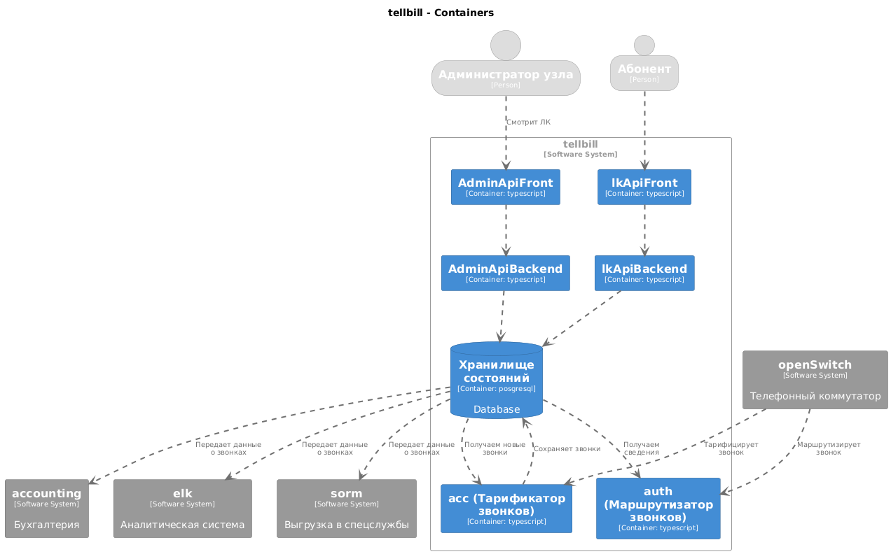

# Diplom

Дипломная работа 2024

## О чем 

Задача диплома состоит в создании прототипа ИС управления узлом связи (УС) телефонного оператора. 

Функциональные требования

- Должно поддерживаться взаимодействие с несколькими внешними УС сторонних операторов через несколько транков. С каждым УС устанавливается отдельный транк.
- Должно поддерживаться взаимодействие с несколькими внутренними ВАТС(например на основе ПО Asterics). С каждой ВАТС устанавливается отдельный транк.
- Каждому абоненту (АБ) присваивается один лицевой счет (ЛС).
- Абоненту может быть оказана услуга "Телефонный номер" (привязан телефонный номер) на определенное время. Возможно бессрочно. 
- Каждый выданный абоненту телефонный номер привязывается к конкретной ВАТС УС
- Стоимость звонка индивидуальна для каждого АБ и ВО  определяется действующим прайслистом на этом контрагенте.
- Каждому внешнему оператору присваивается один лицевой счет.
- К Внешнему Оператору (ВО) может быть привязан транк (много транков) на определенное время, возможно бессрочно. все звонки проходящие по таком транку являются звонками к/от ВО.
- Каждый звонок В ИС описывается в CDR: Временем начала, длительностью, статусом завершения, транк поступления (оригинирующий транк), транк приземления (терменирующий транк), номер звонящего (НомерА), номером кому звонят (НомерБ).
- После проведения тарификаци для каждого звонка расчитывается оригинационное и терминационное плечо звонка. Плечо - это коммерческая состовляющая по звонку, содержит номер ЛС, цена за минуту, тарифицируемая длительность, стоимость, номер применнного прайслиста.
- В момент вхождения звонка на узел по запросу телефонного коммутатора  маршрутизатор вычисляет контрагента, проверяет его баланс и блокировки, вычисляет терминационный транк (кому направлять звонок) и возвращает решение по звонку. Можно/нельзя/В какой транк напровлять.
- После завершения звонка формируется запись CDR о звонке, тариффикатор производит расчет оригинационных и терминацинных плеч звонка, происходит запись в таблицы статистики оказанных услуг контрагентам.
- В составе УС должны быть программный модуль ЛК (личный кабинет контрагента УС) в котором видны привязанные услуги (номера и/или транки) и статистика совершенных по ним звонкам (разговорам), отчет по расходам, пополнениям, текущему балансу.
- В составк УС должкн быть программный модуль Стат (личный кабинет администратора УС) в котором производится управление контрагентами, их статусами, привязка к ним услуг (номеров и транков), общая статистика звонков.
- УС должен выгружать звонки в в виде событий во внешние аналитические системы для статистического анализа,а также в систему СОРМ.

## Узел связи состоит

- Сервер аккаунтинга (фиксация CDR)
- Cервер авторизации/маршуртизации
- ВебПриложение ЛК
- Вебприложение Стат
- Хранилище данных

## Временная диаграмма обработки звонка

## Архитектурная модель системы C4

## Сокращения:
- CDR - Call Detail Record - запись о звонке, содержит время начала, длительность, входящий, исходящий транк, номера А,Б,С, статус завершения звонка. Не содержит коммерческую инрфмацию (стоимость, лс и т.д.)
- ИС - информационная система
- АБ - абонент, которому оказывется услуга "Телефонный номер"
- ВО - внешний оператор, по отношению к управляемому ИС УС.
- контрагент - субъект коммерческого взаимодействия с ИС УС. может быть АБ или ВО.
- УС - Узел связи
- ЛС - лицевой счет.
- ЛК - личный кабинет контрагента
- Стат - система управления УС. бекофис
- ВАТС - Виртуальная Автоматическая (Абонентсткая?) Телефонная станция.
- СОРМ - система оперативно розыскных мероприятий.
- Транк, телефонный транк -  логический канал связи двух телефонных узлов которые поддерживает одновременное выпролнение двух или более телефонных соединений (выполнения звонков).

## Полезные ссылки

- https://habr.com/ru/articles/802617/ - Статья про архитектурные слои приложения
- https://c4model.com - архитектурный паттерн моделирования C4model
- https://likec4.dev/tutorial/ - документация по плагину likec4
- https://plantuml.com/ru/ - рендер диаграмм по текстовому описанию
- https://plantuml.com/ru/sequence-diagram - документация по диаграммам последовательности
- https://plantuml.com/ru/ie-diagram - диаграмма отношений (схема БД) 
- https://dev.to/sualeh/create-nice-looking-schema-diagrams-in-plantuml-1jo5
- 

## TODO

- Сделать диаграмму мозгового штурма
- сделать диаграмму контейнеров 
- сделать наброски методики испытаний