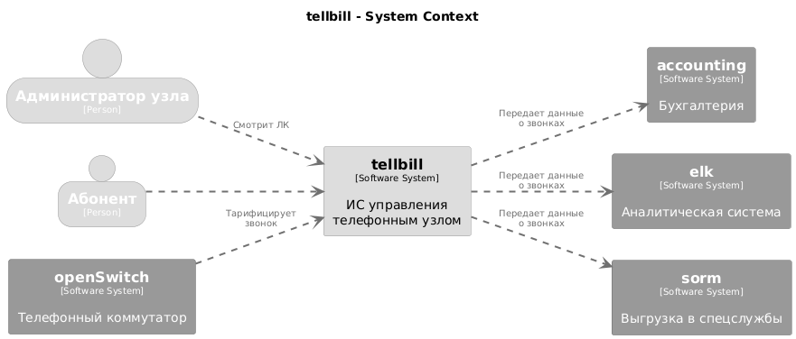

# Диаграмма контекста системы

Диаграмма  контекста обеспечивает отправную точку, которая показывает, как программная система вписывается в окружающий ее мир.

Что показывает:

- Моделируемая система
- Категории пользователей
- Системы, с которыми взаимодействует моделируемая

Что не показывает:

- Технические детали, протоколы, уровни.
- не показываются технологии, вендоры БД и т.д.

Кто использует: Люди от бизнеса, Архитекторы, Руководители разработки.

Вопросы, на которые отвечает диаграмма контекста:

1. Какую систему мы создаем?
2. Кто её использует?
3. Как она вписывается в существующую среду?

Что нужно учесть:

1. Определите пользователей системы.
2. Определите внешние системы которые взаимодействуют с системой
3. Создайте единый прямоугольник, изображающий вашу систему.
4. Добавьте связи между системой, пользователями и внешними системами.
Напишите содержательные комментарии по каждому компоненту.

