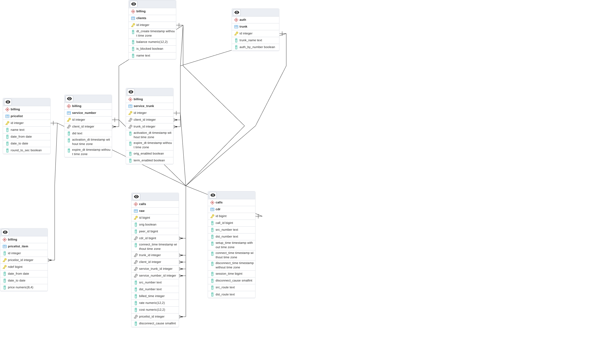

# Структура базы данных

Схема БД сгенерирована автоматически с использованием инструмента [ERD Tool](https://www.pgadmin.org/docs/pgadmin4/development/erd_tool.html) PgAdmin4.0  на основании sql схемы сущностей проекта.

## Файл генерации БД

- [init.sql](/install/cont_postgresql/init.sql)

## Описание схем

Таблицы БД сгрупиррованы по различным схема

- auth  - таблицы описывающие сетевые настройки узла связи
- billing - таблицы описывающие коммерческие настройки узла связи
- calls - таблицы фиксирующие факты прохождения и тарификации звонков через узел связи

## Описание таблица БД

<table>
<tr>
<th>Схема</th>
<th>Таблица</th>
<th>Связи</th>
<th>Описание</th>
</tr>

<tr>
<td>billing</td>
<td>clients</td>
<td>-</td>
<td>Содержит записи описывающие абонентов и операторов с которыми взаимодействует Узел Связи. также есть информация о балансе на начала периода и о факте блокировки.</td>
</tr>

<tr>
<td>billing</td>
<td>pricelist</td>
<td>-</td>
<td>Содержит заголовки прайслистов, по которым происходит тарафикация вызовов.</td>
</tr>

<tr>
<td>billing</td>
<td>pricelist_item</td>
<td>pricelist_id -> billing.pricelist.id</td>
<td>Содержит наполнение прайслистов, стоимость минуты в зависимости от префикса вызываемого номера. Например: код 8926 -> 1.26руб, код 8495 -> 1.5руб. </td>
</tr>

</table>

- billing.clients
