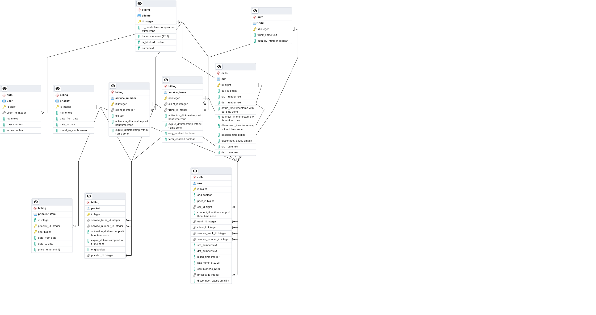

# Структура базы данных

## Файл генерации БД

- [init.sql](/install/cont_postgresql/init.sql)

## Описание схем

Таблицы БД сгрупиррованы по различным схема

- auth  - таблицы описывающие сетевые настройки узла связи
- billing - таблицы описывающие коммерческие настройки узла связи
- calls - таблицы фиксирующие факты прохождения и тарификации звонков через узел связи

## Описание сущностей БД

- billing.clients
